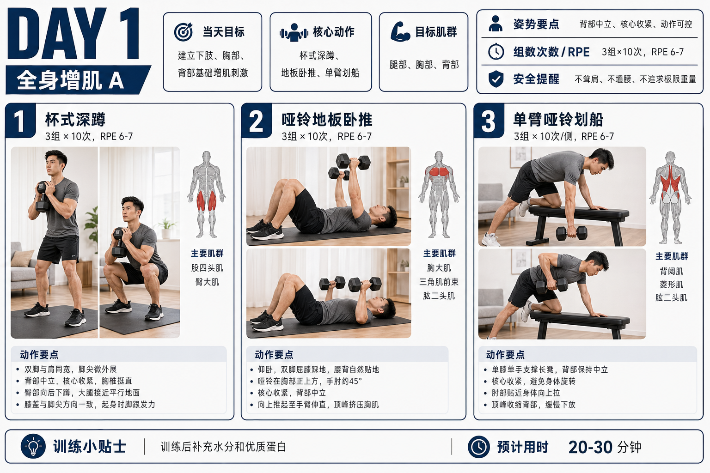
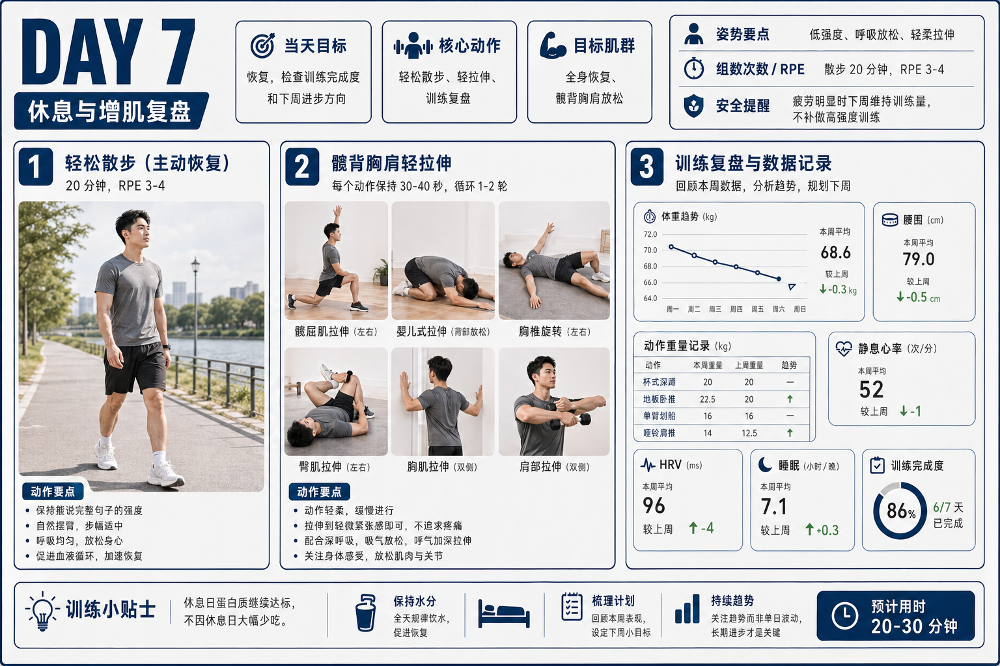

# Claude Skills

这个仓库用于同步和发布本地自定义 Codex/Claude Skills。当前重点新增的 skill 是 `health-plan`：一个面向个人生理数据、健身分析、训练规划和训练示意图生成的健康规划 skill。


## health-plan

`health-plan` 用于把用户提供的体脂秤、穿戴设备或人工整理的生理数据，转化为分阶段的健康与健身规划流程。它不会直接做医学诊断，而是使用非诊断性表达，帮助用户完成身体状态分析、异常数据复核建议、7 天训练计划，以及每日训练海报生成。

### 核心能力

- 解析体重、BMI、体脂率、脂肪量、肌肉量、骨骼肌量、内脏脂肪、基础代谢、水分率、蛋白质率、腰臀比、静息心率、HRV 等指标。
- 在正式分析前收集训练目标、训练经验、器械条件、每日可用时间、伤病史、睡眠状态和饮食限制。
- 对模糊截图、单设备误差、逻辑不一致或高风险指标标记为 `需复测/需确认`。
- 输出身体状态报告、异常数据建议、7 天训练日程和每日训练图生成任务。
- 默认生成 7 张每日训练示意图，每天 1 张，不把整周内容合并成单张总览图。
- 图片生成默认优先使用 OpenAI `gpt-image-2` API 并发生成；缺少 `OPENAI_API_KEY` 或 API 不可用时，降级到 Codex 内置 `imagegen`。

### 交互流程

`health-plan` 采用强制分阶段流程，避免在上下文不足时直接给训练建议：

1. 收到生理数据后，先解析字段，但不直接分析。
2. 优先通过 Codex 内置参数选择组件收集训练上下文；组件不可用时使用中文选项兜底。
3. 收集完整后输出训练上下文摘要，让用户确认或修正。
4. 用户确认后输出身体状态分析和异常数据建议。
5. 用户确认分析后，再进入 7 天健身规划。
6. 用户确认规划后，才进入图片提示词或实际图片生成阶段。
7. 实际出图时按 Day 1 到 Day 7 拆成独立任务，失败时只重试失败当天。

### 图片生成策略

官方 API 路径：

```bash
export OPENAI_API_KEY="你的 OpenAI API Key"
python3 health-plan/scripts/generate_daily_images.py \
  --jobs jobs.json \
  --out-dir output/health-plan \
  --size 1536x1024 \
  --quality medium \
  --concurrency 7
```

无 API Key 时，脚本会返回 `fallback_required=codex_builtin_imagegen`，skill 会切换到 Codex 内置图像生成能力。Codex 内置路径适合作为预览兜底，但不保证真正并发。

`jobs.json` 示例：

```json
[
  {
    "day": 1,
    "prompt": "生成一张 Day 1 全身基础力量训练海报，包含当天目标、核心动作、目标肌群、姿势要点、组数次数/RPE 和安全提醒。"
  }
]
```

### 效果预览

| Day 1 训练指导图 | Day 7 训练指导图 |
|---|---|
|  |  |

### 安全边界

- 不输出医学诊断，不使用“治疗”“治愈”“保证”等承诺性表达。
- 出现胸痛、晕厥、持续异常心率、疑似急性损伤等红旗信号时，优先建议暂停训练并咨询医生。
- 对体脂秤、穿戴设备等消费级设备数据保留不确定性说明。
- 新手训练默认控制在 RPE 6-7，避免高风险大重量动作。

## 安装与同步

首次 clone：

```bash
git clone --recursive https://github.com/vigorX777/claude-skills.git ~/.claude/skills
```

更新已有 clone：

```bash
cd ~/.claude/skills
git pull
git submodule update --init --recursive
```

打包 `health-plan`：

```bash
python3 skill-creator/scripts/quick_validate.py health-plan
python3 skill-creator/scripts/package_skill.py health-plan
```
